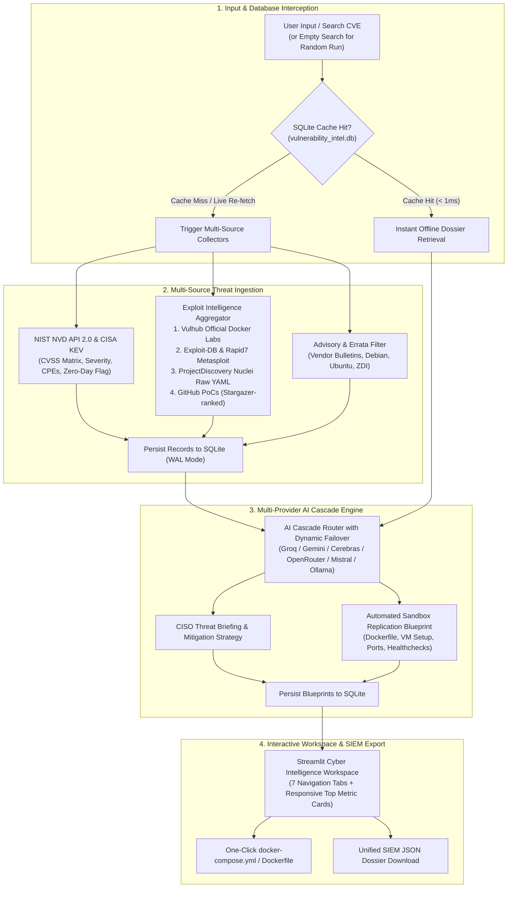

# ⚔️ Vulnerability Lab Builder
### Automated CVE Multi-Source Threat Intelligence & Isolated Sandbox Replication Engine

[](https://www.python.org/)
[](https://streamlit.io/)
[](https://www.sqlite.org/)
[](https://nvd.nist.gov/)
[](https://www.cisa.gov/known-exploited-vulnerabilities-catalog)
[](https://vulhub.org/)
[](https://console.groq.com/)

---

## 📌 Table of Contents

- [Executive Overview](#-executive-overview)
- [System Architecture & Data Flow](#-system-architecture--data-flow)
- [Key Platform Capabilities](#-key-platform-capabilities)
- [Deep Dive: Multi-Provider AI Cascade](#-deep-dive-multi-provider-ai-cascade)
- [Interactive UI Walkthrough (7 Intelligence Tabs)](#-interactive-ui-walkthrough-7-intelligence-tabs)
- [Project Directory Structure](#-project-directory-structure)
- [SQLite Database Schema (`vulnerability_intel.db`)](#-sqlite-database-schema-vulnerability_inteldb)
- [Prerequisites](#-prerequisites)
- [Installation & Setup](#-installation--setup)
- [Environment Configuration (`.env`)](#-environment-configuration-env)
- [🚀 How to Start the System](#-how-to-start-the-system)
  - [Method 1: Interactive Terminal (Standard)](#method-1-interactive-terminal-standard)
  - [Method 2: One-Line Start (Using venv Binary)](#method-2-one-line-start-using-venv-binary)
  - [Method 3: Background Service Start (Headless / Detached)](#method-3-background-service-start-headless--detached)
- [🛑 How to Stop / Terminate the System](#-how-to-stop--terminate-the-system)
  - [Case 1: Stopping Foreground Process](#case-1-stopping-foreground-process)
  - [Case 2: Stopping Background / Detached Process](#case-2-stopping-background--detached-process)
  - [Case 3: Freeing Port 8501 If Blocked](#case-3-freeing-port-8501-if-blocked)
- [Auxiliary Utilities](#-auxiliary-utilities)
- [Troubleshooting Matrix](#-troubleshooting-matrix)

---

## 📖 Executive Overview

Security researchers, penetration testers, and DevSecOps analysts spend up to **60% of their triage time** manually researching, configuring, and debugging vulnerable environments. Raw CVE advisories describe abstract vulnerabilities without actionable reproduction scripts, while online Proof-of-Concept (PoC) repositories are often broken, outdated, or hazardous.

**Vulnerability Lab Builder** solves this bottleneck by unifying real-time multi-source threat intelligence with an intelligent **Multi-Provider AI Cascade** and automated sandbox generation:
1. **Aggregates Multi-Source Intelligence**: Fetches authoritative CVE data from NIST NVD 2.0, flags active zero-days with CISA KEV, and cross-references MITRE standards.
2. **Discovers Verified Exploits with Vulhub Priority**: Prioritizes turnkey **Vulhub Docker Compose environments** first, followed by Exploit-DB records, Rapid7 Metasploit modules, ProjectDiscovery Nuclei YAML templates, and star-ranked GitHub PoC repositories.
3. **Synthesizes Replication Sandboxes**: Employs an automated AI cascade (Groq, Gemini, Mistral, Cerebras, OpenRouter, or local Ollama) to output production-ready Dockerfile blueprints, VM setup guides, execution workflows, and post-exploitation audit commands.
4. **Delivers Instant Offline Lookups**: Caches all queries in an embedded SQLite 3 database (`WAL` mode) with a dedicated database manager and 1-click JSON intelligence export.

---

## 🏗️ System Architecture & Data Flow



---

## ✨ Key Platform Capabilities

### 1. Dual-Action Search & Discovery Engine
- **Targeted Query**: Enter any standard CVE identifier (e.g., `CVE-2016-3088`, `CVE-2021-44228`, `CVE-2024-3400`).
- **Live Re-fetch (`🔄 Live Re-fetch`)**: Explicitly bypasses local cache to pull the latest live threat data and newly published PoCs from upstream feeds.
- **Empty-Query Random Discovery**: Clicking **"🔍 Search CVE"** with an empty field randomly samples a historically analyzed or popular pre-configured CVE from the database.
- **Interactive Welcome Dashboard**: When no CVE is queried, displays database statistics, recently investigated vulnerabilities, and quick-load cards for famous CVEs.

### 2. Prioritized Exploit & Reproduction Intelligence
- **⭐ Priority #1: Official Vulhub Environments**: Checks Vulhub's tree structure (cached in `.vulhub_cache.json` for 24h) to identify verified, pre-built Docker container environments with direct links to raw `docker-compose.yml` configurations.
- **Exploit-DB & Metasploit**: Cross-checks verified exploit codes and Rapid7 Metasploit Framework module paths.
- **ProjectDiscovery Nuclei**: Direct lookup in ProjectDiscovery's raw template repository for automated scanner templates.
- **Curated Security Research**: Gathers deep-dive technical writeups, root-cause analyses, and research papers.
- **Star-Ranked GitHub PoCs**: Ranks open-source GitHub exploit repositories by GitHub stars with repository metadata.

### 3. Authoritative Advisory & Errata Normalizer
- Extracts and intelligently categorizes references into clean visual badges:
  - `CISA / CERT / NIST / MITRE`: Official government and standards alerts
  - `ERRATA / PATCH`: Official vendor patch releases and fixes
  - `DEBIAN / UBUNTU`: Linux distribution security advisories
  - `ZDI / PACKET`: Zero Day Initiative and security broker advisories
  - `RESEARCH / DISCLOSURE`: Technical threat intelligence posts

### 4. High-Performance Embedded SQLite Knowledge Base
- Fully embedded in `vulnerability_intel.db` with Write-Ahead Logging (`WAL` mode).
- Features zero-configuration offline lookups, automated schema migrations, cascading foreign keys, and complete search history tracking.

---

## 🧠 Deep Dive: Multi-Provider AI Cascade

The platform includes a resilient, zero-downtime AI engine implemented in `llm.py` and `ai_generator.py`:

```text
                  [User Request / Analysis Trigger]
                                  │
                                  ▼
                    ┌───────────────────────────┐
                    │  Provider Rate Cooldown?  │
                    └─────────────┬─────────────┘
                                  │ (Select healthy)
       ┌──────────────────────────┼──────────────────────────┐
       ▼                          ▼                          ▼
 ┌───────────┐              ┌───────────┐              ┌───────────┐
 │ GroqCloud │              │  Gemini   │              │ Cerebras  │
 │ Llama-3.3 │              │ 2.5 Flash │              │  GPT-OSS  │
 └─────┬─────┘              └─────┬─────┘              └─────┬─────┘
       │ (Rate Limit/Error)       │ (Failover)               │
       └──────────────────────────┼──────────────────────────┘
                                  ▼
       ┌──────────────────────────┴──────────────────────────┐
       ▼                                                     ▼
 ┌───────────┐                                         ┌───────────┐
 │OpenRouter │                                         │  Mistral  │
 │ Free Tier │                                         │  Client   │
 └─────┬─────┘                                         └─────┬─────┘
       │                                                     │
       └──────────────────────────┬──────────────────────────┘
                                  ▼
                      ┌───────────────────────┐
                      │ Local Ollama (Offline)│
                      │ http://localhost:11434│
                      └───────────────────────┘
```

- **Dynamic Failover**: Transparently cycles through providers if an endpoint returns HTTP 429 (rate-limited), HTTP 500, or a timeout.
- **Key Rotation**: Supports comma-separated keys (`GROQ_API_KEYS`, `GEMINI_API_KEYS`, etc.) for seamless round-robin rotation.
- **Cooldown & Telemetry**: Automatically tracks cooldown timers per provider and logs every API interaction to `logs/apicall.log` and `logs/cve_analyzer.log`.
- **Model Attribution**: Displays which specific provider and model generated the analysis in the UI.

---

## 🖥️ Interactive UI Walkthrough (7 Intelligence Tabs)

### 📊 Top Metric Summary Ribbon
Located at the top of every queried vulnerability with adaptive typography:
- **VENDOR**: Target software or hardware vendor.
- **PRODUCT**: Affected product/package name.
- **PRIMARY SEVERITY**: NVD qualitative severity (`CRITICAL`, `HIGH`, `MEDIUM`, `LOW`).
- **CWE ID**: Common Weakness Enumeration classification (e.g., `CWE-787`, `CWE-79`).
- **CVSS V3 SCORE**: Primary base score (e.g., `9.8`).
- **CISA KEV**: Clear `YES` / `NO` zero-day active exploitation badge.

---

### Tab 1: 📋 Overview
- **Vulnerability Description**: Full technical synopsis from NIST NVD.
- **Lifecycle Timeline**: Publication timestamp and last modification date.
- **CVSS Multi-Source Matrix**: Side-by-side breakdown of CVSS v3.x and CVSS v2.0 scores across all reporting authorities (NVD, vendor CNA, Red Hat, etc.) with complete vector strings.

### Tab 2: 🧠 AI Threat Intel
- **Executive Threat Summary**: Plain-language risk briefing for security leadership.
- **Recommended Defense Action**: Direct remediation guidance and mitigation priorities.
- **Exploitation & Recreation Footprint**: Run-time parameters, affected ports, and known payload shapes.
- **Threat Classification Keywords**: Interactive tags categorizing attack vectors.

### Tab 3: 🧪 Lab Builder
- **⭐ Official Vulhub Lab Callout**: Shown prominently if a turnkey container environment exists, featuring direct links to the Vulhub directory and raw `docker-compose.yml`.
- **AI-Synthesized Replication Sandbox**:
  - `Dockerfile` / `docker-compose.yml` configuration blueprint.
  - VM deployment recommendations (OS version, system dependencies).
  - Required target port mappings.
  - Default administrative and service credentials.
  - Sequential installation workflows.
  - Post-exploitation verification audit commands.

### Tab 4: 🪲 PoCs / Blogs
- **Three-Tier Exploit Presentation**:
  1. *Priority 1*: Prominent Vulhub reproducible container environments.
  2. *Priority 2*: Exploit-DB verified IDs, Rapid7 Metasploit modules, Nuclei YAML templates, and technical research writeups.
  3. *Priority 3*: GitHub PoC repositories sorted by star popularity.

### Tab 5: 🔗 References
- Curated vendor advisories, MITRE CVE entries, CISA Known Exploited bulletins, security notifications, and distribution errata (Debian, Ubuntu, Red Hat) grouped with color-coded badges.

### Tab 6: 💾 Downloads
- Live preview of the normalized intelligence dossier.
- One-click download of the complete JSON payload (`<cve_id>_ai_intel.json`) formatted for SIEM / SOAR pipeline ingestion.

### Tab 7: 🗄️ Database Management
- Real-time platform metrics: stored CVE count, discovered PoCs, exploit feeds, lab blueprints, and AI briefings.
- Searchable local records table with 1-click **"Open Dossier"** navigation.
- **"🗑️ Delete Current CVE from DB"** utility for cache management.

---

## 📂 Project Directory Structure

```text
automation/
├── app.py                   # Main Streamlit web application & tab orchestration
├── database.py              # SQLite database manager & WAL schema handler
├── vulnerability_intel.db   # Local SQLite database file (auto-generated)
├── llm.py                   # Multi-Provider Free LLM Cascade & Telemetry Engine
├── ai_generator.py          # Unified AI wrapper for lab blueprints & analysis
├── config.py                # Global configurations & API endpoints
├── cve_collector.py         # NIST NVD API 2.0 & CISA KEV fetcher and parser
├── github_finder.py         # GitHub API client for PoC repository discovery
├── exploit_finder.py        # Exploit-DB, Vulhub, Metasploit, Nuclei & blog aggregator
├── advisory_finder.py       # Vendor security bulletin & reference normalizer
├── attack_intelligence.py   # CVSS vector matrix decoder
├── styles.py                # Cyber dark-mode CSS styling and badge themes
├── utils.py                 # JSON formatting and export helpers
├── requirements.txt         # Python project dependencies
├── .env                     # Environment variables & API keys
├── .vulhub_cache.json       # Cached Vulhub directory tree (auto-refreshed 24h)
├── assets/                  # UI assets and battle shields
│   └── cyber_battle_logo.jpg
├── logs/                    # Application and API telemetry logs
│   ├── apicall.log
│   └── cve_analyzer.log
├── venv/                    # Python virtual environment
├── x.py                     # Codebase-to-PDF export utility
├── documentation.md         # Detailed reproduction engine specifications
├── guide.txt                # Operational quick-start reference
├── pitch guide.txt          # 5-minute video pitch & presentation guide
└── README.md                # Project documentation
```

---

## 🗄️ SQLite Database Schema (`vulnerability_intel.db`)

The platform uses an embedded SQLite 3 database operating in Write-Ahead Logging mode (`PRAGMA journal_mode=WAL`):

| Table Name | Primary Key | Description |
| :--- | :--- | :--- |
| `cves` | `cve_id` (TEXT) | Main CVE metadata, vendor, product, CVSS v2/v3 vectors, CISA KEV flag, reference URLs. |
| `github_pocs` | `id` (INTEGER AUTO) | Discovered GitHub PoC repositories (stars, title, URL, description) foreign-keyed to `cve_id`. |
| `exploit_intelligence` | `id` (INTEGER AUTO) | Vulhub environments, Exploit-DB verified IDs, Metasploit modules, Nuclei templates. |
| `ai_analysis` | `cve_id` (TEXT) | Executive threat briefings, CISO defense actions, recreation footprints, and AI model attribution. |
| `lab_blueprints` | `cve_id` (TEXT) | Synthesized Dockerfiles, VM recommendations, ports, credentials, workflow sequences. |
| `search_history` | `id` (INTEGER AUTO) | User search logs with timestamps powering recent search lists and random discovery. |

---

## ⚙️ Prerequisites

1. **Operating System**: Linux (Kali Linux, Ubuntu, Debian), macOS, or Windows (via WSL2).
2. **Python**: Python `3.10+` (tested with Python `3.11` and `3.12`).
3. **Optional Network Utilities**:
   - `git` (for cloning and repository lookups)
   - `curl` / `wget` (for testing replication endpoints)
   - `docker` and `docker compose` (for launching generated lab containers)

---

## 🛠️ Installation & Setup

If setting up on a new system or repository clone:

1. **Clone or Navigate to the project root**:
   ```bash
   cd /home/kali/Desktop/automation
   ```

2. **Create a Python Virtual Environment**:
   ```bash
   python3 -m venv venv
   ```

3. **Activate the Virtual Environment**:
   ```bash
   source venv/bin/activate
   ```

4. **Install Python Dependencies**:
   ```bash
   pip install --upgrade pip
   pip install -r requirements.txt
   ```

5. **Configure Environment Keys**:
   Create or edit your `.env` file in the project root:
   ```bash
   touch .env
   ```

---

## 🔐 Environment Configuration (`.env`)

The platform operates out of the box for CVE metadata, NVD scores, CISA KEV, Vulhub, Exploit-DB, and GitHub searches without API keys.

To enable the **AI Threat Intelligence** and **Lab Builder Sandbox Synthesis**, configure at least one free or paid LLM provider in `.env`:

```ini
# ==============================================================================
# Vulnerability Lab Builder - Environment Configuration
# ==============================================================================

# 1. GroqCloud (Recommended Free Tier: https://console.groq.com)
GROQ_API_KEYS="gsk_your_groq_key_1, gsk_your_groq_key_2"

# 2. Google Gemini API (Free Tier: https://aistudio.google.com/)
GEMINI_API_KEYS="AIzaSy_your_gemini_key"

# 3. Cerebras Inference (Ultra-Fast Free Tier: https://cerebras.ai/)
CEREBRAS_API_KEYS="csk_your_cerebras_key"

# 4. OpenRouter Free Tier (https://openrouter.ai/)
OPENROUTER_API_KEY="sk-or-v1-your_openrouter_key"

# 5. Mistral AI (https://console.mistral.ai/)
MISTRAL_API_KEY="your_mistral_api_key"

# 6. Local Ollama (For Offline / Air-Gapped Environments)
OLLAMA_BASE_URL="http://localhost:11434/v1"
```

> **Pro-Tip**: You can pass multiple comma-separated keys for `GROQ_API_KEYS`, `GEMINI_API_KEYS`, etc. The cascade engine automatically rotates through them.

---

## 🚀 How to Start the System

You can run the web platform using any of the following workflows:

### Method 1: Interactive Terminal (Standard)

Best for development and watching real-time terminal output:

```bash
cd /home/kali/Desktop/automation
source venv/bin/activate
streamlit run app.py
```

The browser will automatically open to `http://localhost:8501`.

---

### Method 2: One-Line Start (Using venv Binary)

Direct launch without manually activating the virtual environment in your current shell:

```bash
/home/kali/Desktop/automation/venv/bin/streamlit run /home/kali/Desktop/automation/app.py
```

To bind to all network interfaces or run on a custom port:
```bash
/home/kali/Desktop/automation/venv/bin/streamlit run /home/kali/Desktop/automation/app.py --server.port 8501 --server.address 0.0.0.0
```

---

### Method 3: Background Service Start (Headless / Detached)

Best for keeping the platform running persistently in the background after closing the terminal:

```bash
cd /home/kali/Desktop/automation
nohup ./venv/bin/streamlit run app.py --server.headless true > app.log 2>&1 &
```

To tail live server logs:
```bash
tail -f app.log
```

---

## 🛑 How to Stop / Terminate the System

### Case 1: Stopping Foreground Process
If running in an active terminal:
1. Press `Ctrl + C` in the running terminal window.
2. Type `deactivate` to exit the virtual environment.

---

### Case 2: Stopping Background / Detached Process
If running via `nohup` or background tasks:

```bash
pkill -f "streamlit run app.py"
```

Or terminate by specific process ID (PID):
```bash
pgrep -f "streamlit run app.py"
kill <PID>
```

---

### Case 3: Freeing Port 8501 If Blocked
If Streamlit exited abruptly and port `8501` is still held open:

1. Identify the blocking process:
   ```bash
   lsof -i :8501
   ```
2. Forcibly terminate the process holding port `8501`:
   ```bash
   fuser -k 8501/tcp
   ```

---

## 📄 Auxiliary Utilities

### Exporting Full Project Codebase to PDF (`x.py`)

The workspace contains `x.py`, an automated documentation compiler that traverses the project directory, respects `.gitignore` rules, masks sensitive `.env` secrets, and builds an indexed PDF document with an ASCII tree into `test.pdf`.

To run:
```bash
cd /home/kali/Desktop/automation
./venv/bin/python x.py
```

---

## ❓ Troubleshooting Matrix

| Issue | Cause | Solution |
| :--- | :--- | :--- |
| `Address already in use: 8501` | A dangling Streamlit instance is still bound to port `8501`. | Execute `fuser -k 8501/tcp` or `pkill -f streamlit`. |
| `All LLM Providers Failed` | No valid API keys are configured in `.env` or all providers are rate-limited. | Add at least one free key for Groq (`GROQ_API_KEYS`) or Gemini (`GEMINI_API_KEYS`) in `.env`, or run Ollama locally. |
| `NVD API Timeout / 403` | NIST NVD API temporary throttling. | Wait a few seconds and click **"🔄 Live Re-fetch"**. The collector has built-in retry handling. |
| `ModuleNotFoundError` | Virtual environment dependencies are missing. | Run `source venv/bin/activate && pip install -r requirements.txt`. |
| `Database is locked` | Another process accessed SQLite during a write. | The system uses WAL mode to prevent locks. If it occurs, wait 1 second; the query will retry automatically. |
| Vulhub raw compose URL fails | GitHub API temporary rate limit. | The platform falls back to `.vulhub_cache.json` automatically without blocking. |

---

<p align="center">
  <b>⚔️ Vulnerability Lab Builder</b> • Built for Security Researchers, Pentesters, and Blue Teams.
</p>
