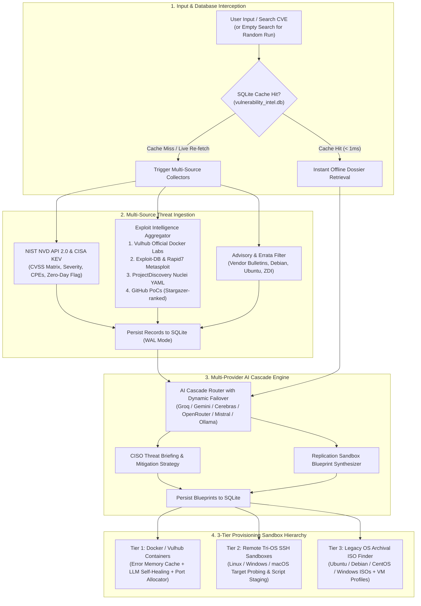

# ⚔️ Vulnerability Lab Builder
### Automated CVE Multi-Source Threat Intelligence & 3-Tier Sandbox Replication Engine

[](https://www.python.org/)
[](https://streamlit.io/)
[](https://www.sqlite.org/)
[](https://nvd.nist.gov/)
[](https://www.cisa.gov/known-exploited-vulnerabilities-catalog)
[](https://vulhub.org/)
[](https://github.com/)
[](https://console.groq.com/)

---

## 📌 Table of Contents

- [Executive Overview](#-executive-overview)
- [System Architecture & 3-Tier Provisioning](#-system-architecture--3-tier-provisioning)
- [Key Platform Capabilities](#-key-platform-capabilities)
  - [1. 3-Tier Sandbox Provisioning Hierarchy](#1-3-tier-sandbox-provisioning-hierarchy)
  - [2. Case-Based Reasoning (CBR) Error Resolution Registry (Error Memory)](#2-case-based-reasoning-cbr-error-resolution-registry-error-memory)
  - [3. Closed-Loop LLM Self-Healing Engine](#3-closed-loop-llm-self-healing-engine)
  - [4. Automated TCP & HTTP Banner Verification Auditor](#4-automated-tcp--http-banner-verification-auditor)
  - [5. Prioritized Multi-Source Exploit Intelligence](#5-prioritized-multi-source-exploit-intelligence)
- [Deep Dive: Multi-Provider AI Cascade](#-deep-dive-multi-provider-ai-cascade)
- [Interactive UI Walkthrough (7 Intelligence Tabs)](#-interactive-ui-walkthrough-7-intelligence-tabs)
- [Project Directory Structure](#-project-directory-structure)
- [SQLite Database Schema (`vulnerability_intel.db`)](#-sqlite-database-schema-vulnerability_inteldb)
- [Prerequisites](#-prerequisites)
- [Installation & Setup](#-installation--setup)
- [Environment Configuration (`.env`)](#-environment-configuration-env)
- [🚀 How to Start the System](#-how-to-start-the-system)
- [🛑 How to Stop / Terminate the System](#-how-to-stop--terminate-the-system)
- [Troubleshooting Matrix](#-troubleshooting-matrix)

---

## 📖 Executive Overview

Security researchers, penetration testers, and DevSecOps analysts spend up to **60% of their triage time** manually researching, configuring, and debugging vulnerable environments. Raw CVE advisories describe abstract vulnerabilities without actionable reproduction scripts, while online Proof-of-Concept (PoC) repositories are often broken, outdated, or hazardous.

**Vulnerability Lab Builder** solves this bottleneck by unifying real-time multi-source threat intelligence with an intelligent **Multi-Provider AI Cascade** and a **3-Tier Sandbox Replication Engine**:
1. **Aggregates Multi-Source Intelligence**: Fetches authoritative CVE data from NIST NVD 2.0, flags active zero-days with CISA KEV, and cross-references MITRE standards.
2. **Prioritized Exploit Intelligence**: Prioritizes turnkey **Vulhub Docker Compose environments** first, followed by Exploit-DB records, Rapid7 Metasploit modules, ProjectDiscovery Nuclei YAML templates, and star-ranked GitHub PoC repositories.
3. **3-Tier Provisioning Hierarchy**:
   - **Tier 1 (Priority): Local Container Sandbox** — Turnkey Vulhub recipes and AI Dockerfile synthesis with closed-loop self-healing, live container controls, and TCP/HTTP health auditing.
   - **Tier 2 (Backup): Remote Tri-OS SSH Sandboxes** — Dedicated remote physical or virtual machines (Linux, Windows, macOS) configured via `.env` with automated OS fingerprinting and non-interactive script staging.
   - **Tier 3 (Fallback): Legacy OS Archival Intelligence & ISO Finder** — Matches historical OS builds, official archive mirrors (Ubuntu old-releases, Debian archive, CentOS vault, Windows Server eval), and hypervisor hardware profiles for vintage kernel CVEs.
4. **Case-Based Reasoning (CBR) Error Resolution Registry (Error Memory)**: Caches verified build failure solutions in SQLite, applying instant fixes in `< 1ms` at `0 token cost` before cascading to LLMs.
5. **Delivers Instant Offline Lookups**: Caches all queries in an embedded SQLite 3 database (`WAL` mode) with a dedicated database manager and 1-click JSON intelligence export.

---

## 🏗️ System Architecture & 3-Tier Provisioning



---

## ✨ Key Platform Capabilities

### 1. 3-Tier Sandbox Provisioning Hierarchy

The engine establishes a rigorous academic provisioning hierarchy to guarantee replication success across any CVE:
- **Tier 1 (Priority): Local Container Sandbox**:
  - Leverages local Docker Engine on Windows, Linux, or macOS.
  - Turnkey 1-click deployment for discovered Vulhub recipes.
  - Collision-free port allocation (e.g. testing `8080` ➔ dynamically rebinding to `8081` if in use).
  - Active container controls: Stop, Restart, live Stdout/Stderr logs, and TCP/HTTP health auditing.
- **Tier 2 (Backup): Remote Tri-OS SSH Sandboxes**:
  - Supports 3 dedicated execution targets configured via `.env` (`Linux`, `Windows`, `macOS`).
  - Automated remote SSH OS fingerprinting (`uname -s -r -m`, `/etc/os-release`, Windows PowerShell version, macOS `sw_vers`, Python environment, ping latency).
  - Non-interactive script staging: automatically encodes scripts to Base64 (UTF-8 for Linux/macOS, UTF-16LE for Windows PowerShell) to bypass quote escaping, executing with live exit code and duration tracking.
- **Tier 3 (Fallback): Legacy OS Archival Intelligence & ISO Finder**:
  - Activated when vulnerability requirements cannot be satisfied by Docker containers or the current 3 remote sandboxes (e.g. vintage Linux kernels < 3.x, Windows Server 2008/2012, or retired glibc builds).
  - Automatically recommends exact historical operating system releases with direct official archive mirror download links.
  - Generates package mirror configurations (`apt` / `yum` sed replacement commands) to resolve 404 errors on retired distributions.
  - Defines VM hypervisor profiles (RAM, vCPU, Host-Only isolated network adapter) for VirtualBox and VMware.

---

### 2. Case-Based Reasoning (CBR) Error Resolution Registry (Error Memory)

Repeated container build failures (e.g. Debian EOL mirrors, non-interactive debconf prompts, PEP 668 pip errors, CentOS vault 404s) waste time and LLM tokens. The platform implements an experience cache in SQLite:
- **Deterministic Regex Signatures**: Pre-seeded with common Docker build traps (`APT_DEBIAN_ARCHIVE_404`, `DEBIAN_FRONTEND_INTERACTIVE_HANG`, `PIP_PEP668_EXTERNALLY_MANAGED`, `YUM_CENTOS_VAULT_404`, `GPG_KEYSERVER_TIMEOUT`).
- **Dynamic Error Hashing**: Normalizes and hashes novel error lines for instant matching.
- **Fast-Path Application**: Checks memory cache *before* calling any AI models. If a match is found, the verified patch is applied in `< 1ms` consuming `0 LLM tokens`.
- **Closed-Loop Learning**: When the multi-turn LLM cascade successfully repairs a novel build failure, it is automatically persisted into `error_registry` with reuse metrics.

---

### 3. Closed-Loop LLM Self-Healing Engine

Inspired by *Chen et al. (ICLR '24 Self-Debugging)* and *Hu et al. (Repo2Run)*:
- Captures verbose `stderr` and `stdout` during failed `docker build` executions.
- Truncates and sanitizes compiler and package manager traces to the most informative diagnostic lines.
- Maintains a **Reflexion Memory Buffer** of previous failed attempts so the LLM does not repeat mistakes.
- Prompts the Multi-Provider AI Cascade to synthesize a complete, repaired `Dockerfile`.
- Computes standard unified diffs (`diff_block`) to visualize applied patches in the UI.

---

### 4. Automated TCP & HTTP Banner Verification Auditor

Implemented in `lab_verifier.py`:
- Performs TCP three-way handshake socket probes against active container ports.
- Issues non-destructive HTTP requests with standard browser headers.
- Evaluates HTTP response codes (`200 OK`, `302 Found`, `401 Unauthorized`).
- Extracts web server header banners (`Server: Apache/2.4.49`, `X-Powered-By: PHP/7.4.3`) and HTML page titles to verify service health before exploitation testing.

---

### 5. Prioritized Multi-Source Exploit Intelligence

- **⭐ Priority #1: Official Vulhub Environments**: Cached locally (`.vulhub_cache.json`) for 24h with direct links to raw `docker-compose.yml`.
- **Exploit-DB & Metasploit**: Cross-checks verified exploit codes and Rapid7 Metasploit Framework module paths.
- **ProjectDiscovery Nuclei**: Direct lookup in ProjectDiscovery's raw template repository for automated scanner templates.
- **Curated Security Research**: Gathers deep-dive technical writeups, root-cause analyses, and research papers.
- **Star-Ranked GitHub PoCs**: Ranks open-source GitHub exploit repositories by GitHub stars.

---

## 🧠 Deep Dive: Multi-Provider AI Cascade

The platform includes a resilient, zero-downtime AI engine implemented in `llm.py` and `ai_generator.py`:

- **Dynamic Failover**: Transparently cycles through providers if an endpoint returns HTTP 429 (rate-limited), HTTP 500, or a timeout:
  `Groq (Llama 3.3 70B)` ➔ `Gemini 2.5 Flash` ➔ `Mistral AI` ➔ `Cerebras Cloud` ➔ `OpenRouter` ➔ `Local Ollama`.
- **Key Rotation**: Supports comma-separated keys (`GROQ_API_KEYS`, `GEMINI_API_KEYS`, etc.) for seamless round-robin rotation.
- **Cooldown & Telemetry**: Automatically tracks cooldown timers per provider and logs every API interaction to `logs/apicall.log` and `logs/cve_analyzer.log`.

---

## 🖥️ Interactive UI Walkthrough (7 Intelligence Tabs)

### 📊 Top Metric Summary Ribbon
- **VENDOR**, **PRODUCT**, **PRIMARY SEVERITY** (`CRITICAL`, `HIGH`, `MEDIUM`, `LOW`), **CWE ID**, **CVSS V3 SCORE**, and **CISA KEV** zero-day active exploitation badge.

### Tab 1: 📋 Overview
- Full technical synopsis from NIST NVD, publication and modification timeline, and CVSS Multi-Source Matrix.

### Tab 2: 🧠 AI Threat Intel
- Executive Threat Summary, Recommended Defense Actions, Exploitation & Recreation Footprint, and Threat Classification Keywords.

### Tab 3: 🧪 Lab Builder (3-Tier Provisioning Engine)
- **⚡ Error Memory Registry Telemetry**: Displays cached build solutions with `<1ms` fast-path stats and expander to inspect signatures.
- **🐳 Tier 1: Local Container Sandbox**:
  - Live Docker daemon status ribbon.
  - Active running container control center (Stop, Restart, Health Audit, Real-Time Log Streamer).
  - Vulhub 1-click deployment.
  - Blueprint build with AI Self-Healing, max retry counter, and unified patch diff telemetry.
- **🖥️ Tier 2: Remote SSH Sandboxes**:
  - Tri-OS selector (`Linux`, `Windows`, `macOS`).
  - One-click `🔍 Probe OS` for automated remote OS fingerprinting (kernel, arch, Python, ping latency).
  - Editable reproduction script area with one-click `🚀 Deploy & Execute on Sandbox`.
  - Live execution results with exit code, duration, stdout, and stderr tabs.
- **💿 Tier 3: Legacy OS Archival Intelligence & ISO Finder**:
  - Automatic CVE-to-historical-OS matching.
  - Direct download links to official archive ISO mirrors (Ubuntu old-releases, Debian archive, CentOS vault, Windows eval).
  - EOL Package Mirror configuration commands (fixing 404s).
  - VM hypervisor hardware specs (RAM, vCPUs, Host-Only network containment) and copy-paste setup guides.

### Tab 4: 🪲 PoCs / Blogs
- Three-tier exploit presentation: Vulhub priority ➔ Exploit-DB / Metasploit / Nuclei / Research ➔ Star-ranked GitHub PoCs.

### Tab 5: 🔗 References
- Curated vendor advisories, MITRE CVE entries, CISA Known Exploited bulletins, and distribution errata (Debian, Ubuntu, Red Hat).

### Tab 6: 💾 Downloads
- Live preview of normalized intelligence dossier and one-click JSON payload download (`<cve_id>_ai_intel.json`) for SIEM/SOAR ingestion.

### Tab 7: 🗄️ Database Management
- Real-time platform metrics: stored CVE count, discovered PoCs, exploit feeds, lab blueprints, AI briefings, and deployed labs.
- Searchable records table with 1-click **"Open Dossier"** navigation and cache deletion.

---

## 📂 Project Directory Structure

```text
ATI-Project/
├── app.py                   # Main Streamlit web application & tab orchestration
├── database.py              # SQLite database manager & WAL schema handler
├── vulnerability_intel.db   # Local SQLite database file (auto-generated)
├── docker_manager.py        # Active container manager, port allocator, Vulhub & blueprint runner
├── error_healer.py          # Closed-loop LLM self-debugging agent & diff generator
├── error_registry.py        # Case-Based Reasoning (CBR) Error Memory Registry
├── lab_verifier.py          # Automated TCP socket & HTTP web banner health auditor
├── ssh_sandbox.py           # Tri-OS Remote SSH Sandbox Engine (Linux, Windows, macOS)
├── os_archives.py           # Legacy OS Archival Intelligence & ISO Finder
├── llm.py                   # Multi-Provider Free LLM Cascade & Telemetry Engine
├── ai_generator.py          # Unified AI wrapper for lab blueprints & analysis
├── config.py                # Global configurations & API endpoints
├── cve_collector.py         # NIST NVD API 2.0 & CISA KEV fetcher and parser
├── github_finder.py         # GitHub API client for PoC repository discovery
├── exploit_finder.py        # Exploit-DB, Vulhub, Metasploit, Nuclei & blog aggregator
├── advisory_finder.py       # Vendor security bulletin & reference normalizer
├── attack_intelligence.py   # CVSS vector matrix decoder
├── styles.py                # Cyber dark-mode CSS styling and badge themes
├── utils.py                 # JSON formatting and export helpers
├── requirements.txt         # Python project dependencies
├── .env                     # Environment variables, API keys & Sandbox credentials
├── .vulhub_cache.json       # Cached Vulhub directory tree (auto-refreshed 24h)
├── labs/                    # Local build workspace for deployed containers (gitignored)
├── assets/                  # UI assets and battle shields
│   └── cyber_battle_logo.jpg
├── logs/                    # Application and API telemetry logs
│   ├── apicall.log
│   └── cve_analyzer.log
├── documentation.md         # Detailed reproduction engine architecture specifications
├── guide.txt                # Operational quick-start reference
└── README.md                # Project documentation
```

---

## 🗄️ SQLite Database Schema (`vulnerability_intel.db`)

Operates in Write-Ahead Logging mode (`PRAGMA journal_mode=WAL`):

| Table Name | Primary Key | Description |
| :--- | :--- | :--- |
| `cves` | `cve_id` (TEXT) | Main CVE metadata, vendor, product, CVSS v2/v3 vectors, CISA KEV flag, reference URLs. |
| `github_pocs` | `id` (INTEGER AUTO) | Discovered GitHub PoC repositories (stars, title, URL, description) foreign-keyed to `cve_id`. |
| `exploit_intelligence` | `id` (INTEGER AUTO) | Vulhub environments, Exploit-DB verified IDs, Metasploit modules, Nuclei templates. |
| `ai_analysis` | `cve_id` (TEXT) | Executive threat briefings, CISO defense actions, recreation footprints, and model attribution. |
| `lab_blueprints` | `cve_id` (TEXT) | Synthesized Dockerfiles, VM recommendations, ports, credentials, workflow sequences. |
| `deployed_labs` | `cve_id` (TEXT) | Active container deployments, host ports, health audits, and self-healing patch history. |
| `error_registry` | `id` (INTEGER AUTO) | Case-Based Reasoning error signatures, patches, model sources, and reuse counts. |
| `search_history` | `id` (INTEGER AUTO) | User search logs with timestamps powering recent search lists and random discovery. |

---

## ⚙️ Prerequisites

1. **Operating System**: Windows (10/11), Linux (Ubuntu, Debian, Kali), or macOS.
2. **Python**: Python `3.10+` (tested with Python `3.11`, `3.12`, `3.13`).
3. **Container Engine (Optional for Tier 1)**: Docker Desktop (Windows/macOS) or Docker Engine (Linux).
4. **SSH Targets (Optional for Tier 2)**: Any reachable Linux, Windows (OpenSSH), or macOS machine with SSH credentials.

---

## 🛠️ Installation & Setup

1. **Clone or Navigate to the project root**:
   ```bash
   cd ATI-Project
   ```

2. **Create and Activate a Virtual Environment**:
   - **Linux / macOS**:
     ```bash
     python3 -m venv venv
     source venv/bin/activate
     ```
   - **Windows (PowerShell)**:
     ```powershell
     python -m venv venv
     .\venv\Scripts\Activate.ps1
     ```

3. **Install Python Dependencies**:
   ```bash
   pip install --upgrade pip
   pip install -r requirements.txt
   ```

4. **Configure Environment Keys (`.env`)**:
   Populate your `.env` file with LLM API keys and optional SSH sandbox credentials.

---

## 🔑 Environment Configuration (`.env`)

```bash
# ------------------------------------------------------------------------------
# 1. Multi-Provider AI Cascade API Keys
# ------------------------------------------------------------------------------
GROQ_API_KEYS=gsk_your_groq_key_here
GEMINI_API_KEYS=AIzaSy_your_gemini_key_here
MISTRAL_API_KEYS=your_mistral_key_here
CEREBRAS_API_KEYS=csk_your_cerebras_key_here
OPENROUTER_API_KEY=sk-or-v1-your_openrouter_key_here
# OLLAMA_BASE_URL=http://localhost:11434/v1

# ------------------------------------------------------------------------------
# 2. Tier 2: Remote Tri-OS SSH Sandboxes (Optional)
# ------------------------------------------------------------------------------
# Target 1: Linux Remote Sandbox (Ubuntu, Debian, CentOS, RHEL)
SANDBOX_LINUX_HOST=192.168.1.101
SANDBOX_LINUX_PORT=22
SANDBOX_LINUX_USER=researcher
SANDBOX_LINUX_PASS=LinuxPassword123!
# SANDBOX_LINUX_KEY=~/.ssh/id_rsa
# SANDBOX_LINUX_INFO=Ubuntu 22.04 LTS x86_64

# Target 2: Windows Remote Sandbox (Windows 10/11, Windows Server with OpenSSH)
SANDBOX_WIN_HOST=192.168.1.102
SANDBOX_WIN_PORT=22
SANDBOX_WIN_USER=Administrator
SANDBOX_WIN_PASS=WindowsPassword123!
# SANDBOX_WIN_KEY=
# SANDBOX_WIN_INFO=Windows Server 2022 Datacenter

# Target 3: macOS Remote Sandbox (Darwin / Apple Silicon)
SANDBOX_MAC_HOST=192.168.1.103
SANDBOX_MAC_PORT=22
SANDBOX_MAC_USER=admin
SANDBOX_MAC_PASS=MacPassword123!
# SANDBOX_MAC_KEY=
# SANDBOX_MAC_INFO=macOS 14 Sonoma (Apple Silicon)
```

---

## 🚀 How to Start the System

### Method 1: Interactive Terminal (Standard)
```bash
python -m streamlit run app.py
```
Access the application at `http://localhost:8501`.

### Method 2: Headless / Background Execution
- **Linux / macOS**:
  ```bash
  nohup python3 -m streamlit run app.py --server.port 8501 --server.headless true > logs/streamlit.log 2>&1 &
  ```
- **Windows (PowerShell)**:
  ```powershell
  Start-Process python -ArgumentList "-m streamlit run app.py --server.port 8501 --server.headless true" -WindowStyle Hidden
  ```

---

## 🛑 How to Stop / Terminate the System

- **Foreground**: Press `Ctrl + C` in the running terminal.
- **Port Conflict (8501)**:
  - **Linux / macOS**: `fuser -k 8501/tcp` or `kill -9 $(lsof -t -i:8501)`
  - **Windows**: `Get-NetTCPConnection -LocalPort 8501 | ForEach-Object { Stop-Process -Id $_.OwningProcess -Force }`

---

## ❓ Troubleshooting Matrix

| Issue | Cause | Solution |
| :--- | :--- | :--- |
| **Docker Engine Offline ribbon in UI** | Docker Desktop is not started on the host machine. | Start Docker Desktop. If you only wish to test via SSH or ISO archives, use Tier 2 or Tier 3 subtabs. |
| **Build fails with 404 on archive.debian.org** | Target distribution is End-of-Life. | The **Case-Based Error Memory** automatically patches this via regex rule `APT_DEBIAN_ARCHIVE_404`. If disabled, enable auto-heal. |
| **SSH Target Connection Timed Out** | Target machine IP is incorrect, SSH daemon is stopped, or port 22 is firewalled. | Verify ping reachability and firewall rules on target host (`sudo ufw allow 22` or Windows Firewall). |
| **AI Rate Limit (HTTP 429)** | Provider free-tier quota exhausted. | The AI Cascade automatically switches to the next configured provider (Groq ➔ Gemini ➔ Mistral ➔ Cerebras ➔ Ollama). You can also comma-separate multiple keys in `.env`. |
| **Port Collision on Container Deploy** | Another service is using port 8080. | The system's dynamic port allocator (`find_free_host_port`) automatically detects the conflict and rebinds to an open port (e.g. 8081). |
