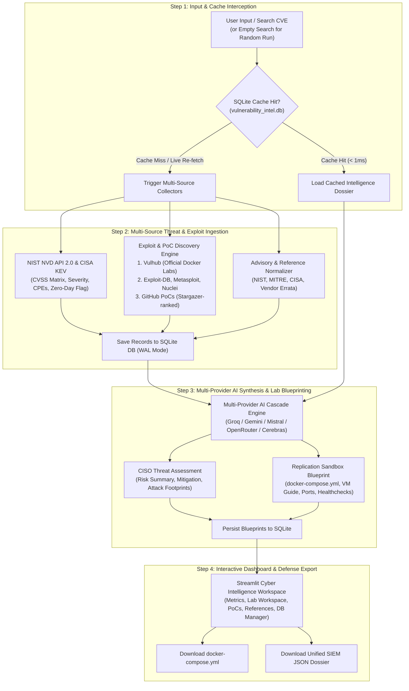

# 🛡️ Automated CVE Lab Builder & Reproduction Architecture Specification

## 1. Executive Summary & Objective

The **Automated CVE Lab Builder & Reproduction Engine** is an integrated threat replication and vulnerability verification framework. Its primary objective is to eliminate manual research overhead for security engineers, analysts, and QA teams by automatically synthesizing an end-to-end, isolated sandbox environment (Docker Compose, VM, or local source build) alongside clear, reproducible validation workflows for any targeted CVE.

---

## 2. System Architecture

```text
+-----------------------------------------------------------------------------------+
|                            User Query (CVE-YYYY-NNNNN)                            |
+-----------------------------------------------------------------------------------+
                                         |
                                         v
+-----------------------------------------------------------------------------------+
|                        Data Ingestion & Threat Feeds                              |
|  - NIST NVD API (CVSS, CWE, affected CPEs, vendor references)                     |
|  - CISA Known Exploited Vulnerabilities (KEV) Catalog                             |
|  - GitHub PoC Finder (stargazers, repository trees, language detection)           |
|  - Exploit Finder (Nuclei raw templates, security research blogs)                 |
+-----------------------------------------------------------------------------------+
                                         |
                                         v
+-----------------------------------------------------------------------------------+
|                    Multi-Provider AI Analysis & Cascade                           |
|  - Deployment Method Classifier (Docker Compose vs. VM vs. Source Build)          |
|  - Reproduction Pattern Analyzer (curl, Python, Raw HTTP, Nuclei, MSF)            |
|  - LLM Prompt Synthesis Engine (Groq / Gemini / Mistral / OpenRouter)             |
+-----------------------------------------------------------------------------------+
                                         |
                                         v
+-----------------------------------------------------------------------------------+
|                       Structured Lab Specification Schema                         |
|  - Environment Deployment Blueprint (docker-compose.yml / VM setup steps)         |
|  - Environment Verification Checks (curl healthchecks, service logs)              |
|  - Step-by-Step Verification & Reproduction Guide                                 |
|  - Expected Telemetry & Indicators of Success (IoCs, HTTP response codes)        |
|  - Comprehensive Troubleshooting Matrix                                            |
+-----------------------------------------------------------------------------------+
                                         |
                                         v
+-----------------------------------------------------------------------------------+
|                             UI Presentation & Export                              |
|  - Streamlit "🧪 Lab Builder" Interactive Sandbox Workspace                       |
|  - One-Click Dockerfile & docker-compose.yml Download                             |
|  - Unified JSON Intelligence Dossier (`cve_intel.json`)                           |
+-----------------------------------------------------------------------------------+
```

### 2.1 4-Step Execution Flowchart



---

## 3. Core Functional Requirements

### 3.1 Deployment Method Identification & Synthesis

The engine dynamically selects the most isolated, repeatable, and lightweight environment suitable for the vulnerability:

1. **Docker Compose (Primary / Preferred Method)**:
   - Generates a standalone, production-ready `docker-compose.yml` file.
   - Identifies official or community container images (e.g., Vulhub, Docker Hub official archives).
   - Declares explicit port bindings, environment variables, dependencies, and persistent volume paths.
   - Provides concrete start commands (`docker compose up -d`) and stop commands (`docker compose down -v`).
   - Supplies verification healthchecks (e.g., `curl -I http://localhost:<port>`).

2. **Virtual Machine / ISO Deployment (Fallback when Docker is infeasible)**:
   - Recommended when kernel-level vulnerabilities, legacy operating systems, or hypervisor-specific features are targeted.
   - Identifies vulnerable software release versions and architecture requirements (x86_64 / arm64).
   - Provides public download links and mirror references.
   - Outlines VM creation parameters (RAM, CPU cores, network adapter type: Host-Only/NAT).
   - Lists default administrative credentials and initial configuration procedures.

3. **Alternative Deployment Methods**:
   - `docker run` one-liners for quick single-container testing.
   - Kubernetes manifests (`Deployment` + `Service`) for clustered environments.
   - Source code compilation workflows (`git clone`, configure, make, run).
   - Package manager installation instructions for target OS (Debian/Ubuntu/RHEL).

---

### 3.2 Reproduction & Validation Pattern Generation

Depending on available intelligence, the system documents execution workflows across all applicable modalities:

| Modality | Generated Details & Output Requirements |
|---|---|
| **Python Script** | Purpose of script, dependencies (`requirements.txt`), command line arguments, execution syntax, and expected terminal output indicating successful reproduction. |
| **curl Command** | Self-contained `curl` invocation with all necessary headers (`Content-Type`, `User-Agent`), HTTP methods, payload strings, and expected HTTP status code / response body. |
| **Raw HTTP Request** | Formatted raw HTTP/1.1 or HTTP/2 request block with instructions for: <ul><li>Burp Suite Repeater</li><li>curl (`--data-binary`)</li><li>Python `requests`</li><li>Postman</li></ul> |
| **Nuclei Template** | Nuclei command syntax (`nuclei -t <template> -u http://localhost:<port>`), match conditions, and terminal output interpretation. |
| **Metasploit Module** | Module path (`use <module>`), required `set` options (`RHOSTS`, `RPORT`, `TARGETURI`), `check` command, and session validation. |

---

### 3.3 Lab Specification Requirements

Each generated lab guide must include the following metadata:

1. **Target Software Profile**: Exact vulnerable product name, vendor, and affected version ranges.
2. **Host & OS Prerequisites**: Minimum operating system requirements, package dependencies, and hypervisor/container runtimes.
3. **Database & Backend Initialization**: Database engines (MySQL, PostgreSQL, MongoDB, Redis), initialization SQL scripts, or default database schemas.
4. **Default Credentials**: Default usernames, passwords, API tokens, and administrative roles.
5. **Configuration Modifications**: Configuration files needing modification (e.g., `php.ini`, `application.yml`, `nginx.conf`) to enable vulnerable conditions or debugging logs.
6. **Network & Port Bindings**: Target ports, host-to-container port mappings, and firewall considerations.
7. **Pre-Flight Health Verification**: Step-by-step checks to confirm the vulnerable application is fully initialized before attempting reproduction.

---

### 3.4 Step-by-Step Reproduction Guide

The reproduction guide must be chronological and clear for beginners:

1. **Environment Initialization**: Starting containers or booting the VM.
2. **Target State Confirmation**: Navigating to web UI or issuing a health probe.
3. **Validation Trigger Execution**: Executing the chosen validation pattern (curl / Python / Nuclei).
4. **Verification & Audit**: Reviewing server logs, responses, or process lists to confirm behavior.
5. **Indicators of Success (IoCs)**: Specific log signatures, error codes, or modified state indicating successful reproduction.

---

### 3.5 Troubleshooting Matrix

Every lab blueprint must include troubleshooting procedures covering:
- **Port Conflicts**: Resolving `bind: address already in use` (identifying processes with `lsof -i`).
- **Container Build / Pull Failures**: Missing base images, upstream registry deprecations, or network DNS issues.
- **Dependency Failures**: Missing Python packages, compilation toolchains (`build-essential`), or runtime libraries.
- **Authentication & Setup Errors**: Account lockouts, expired certificates, or incorrect default passwords.
- **Reproduction Inconsistencies**: Timing issues, race conditions, WAF blocks, or browser cache interference.

---

### 3.6 Authoritative References & Data Provenance

The system aggregates and cross-links:
- Official vendor security advisories and security bulletins.
- NIST NVD metrics and CVSS vector details.
- CISA KEV catalog references.
- Verified GitHub Proof-of-Concept repositories with star ratings.
- Authoritative writeups (e.g., ProjectDiscovery, Assetnote, Trend Micro, Exploit-DB).

---

## 4. Technical Data Schema

All generated lab blueprints follow a strict JSON schema to allow seamless frontend rendering and programmatic API export:

```json
{
  "cve_id": "CVE-2024-XXXX",
  "product": "Example Software",
  "vendor": "Example Vendor",
  "affected_versions": "<= 2.4.1",
  "lab_difficulty": "Low | Medium | High",
  "recommended_deployment": "docker_compose | vm | source | package",
  "deployment_methods": {
    "docker_compose": {
      "filename": "docker-compose.yml",
      "content": "version: '3.8'\nservices:\n  vulnerable-app:\n    image: example/vulnerable-app:2.4.0\n    ports:\n      - '8080:80'",
      "prerequisites": ["Docker Engine >= 24.0", "Docker Compose v2"],
      "start_command": "docker compose up -d",
      "stop_command": "docker compose down -v",
      "verification_command": "curl -sI http://localhost:8080 | grep '200 OK'"
    },
    "docker_run": {
      "command": "docker run -d -p 8080:80 --name test-cve example/vulnerable-app:2.4.0"
    },
    "vm_setup": {
      "recommended_os": "Ubuntu 20.04 LTS (x86_64)",
      "download_url": "https://example.com/downloads/vulnerable-app-2.4.0.iso",
      "ram_mb": 4096,
      "cpu_cores": 2,
      "network_type": "Host-Only / NAT",
      "credentials": "admin:admin123",
      "setup_steps": [
        "Install Ubuntu 20.04 in VirtualBox with 4GB RAM",
        "Download package archive and run install.sh",
        "Restart systemd service"
      ]
    }
  },
  "reproduction_modalities": {
    "curl": {
      "command": "curl -X POST http://localhost:8080/api/v1/trigger -H 'Content-Type: application/json' -d '{\"input\":\"test\"}'",
      "parameters_explained": {
        "-X POST": "Specifies the HTTP method",
        "-H 'Content-Type'": "Declares JSON request body payload",
        "-d": "Carries the trigger payload"
      },
      "expected_status": 200,
      "expected_response": "{\"status\":\"debug_enabled\"}"
    },
    "python": {
      "script_filename": "reproduce_cve.py",
      "dependencies": ["requests>=2.31.0"],
      "execution_command": "python3 reproduce_cve.py --target http://localhost:8080",
      "expected_output": "[+] Target vulnerable. Debug response received."
    },
    "raw_http": {
      "raw_request": "POST /api/v1/trigger HTTP/1.1\r\nHost: localhost:8080\r\nContent-Type: application/json\r\nContent-Length: 17\r\n\r\n{\"input\":\"test\"}",
      "burp_instructions": "Send request to Repeater tab and click Send.",
      "python_requests_equivalent": "import requests\nr = requests.post('http://localhost:8080/api/v1/trigger', json={'input':'test'})\nprint(r.text)"
    },
    "nuclei": {
      "template_id": "cve-2024-xxxx",
      "command": "nuclei -u http://localhost:8080 -id cve-2024-xxxx",
      "match_indicator": "[cve-2024-xxxx] [http] [critical] http://localhost:8080"
    },
    "metasploit": {
      "module_name": "exploit/multi/http/example_module",
      "commands": [
        "msfconsole -q",
        "use exploit/multi/http/example_module",
        "set RHOSTS 127.0.0.1",
        "set RPORT 8080",
        "check"
      ]
    }
  },
  "step_by_step_workflow": [
    {
      "step_number": 1,
      "title": "Start Vulnerable Environment",
      "command": "docker compose up -d",
      "description": "Pulls required container images and starts services in isolated bridge network."
    },
    {
      "step_number": 2,
      "title": "Confirm Service Availability",
      "command": "curl -sI http://localhost:8080",
      "description": "Verifies that the web service is responding with HTTP 200 before proceeding."
    },
    {
      "step_number": 3,
      "title": "Execute Verification Trigger",
      "command": "curl -X POST http://localhost:8080/api/v1/trigger ...",
      "description": "Sends verification request to evaluate service handling."
    },
    {
      "step_number": 4,
      "title": "Audit Telemetry & Logs",
      "command": "docker compose logs --tail=20 vulnerable-app",
      "description": "Inspects container logs to observe error traces or authentication bypass events."
    }
  ],
  "troubleshooting": [
    {
      "issue": "Port 8080 already in use",
      "cause": "Another local process or Docker container is bound to 8080.",
      "solution": "Identify process with 'lsof -i :8080' and terminate, or change host port in docker-compose.yml to 8081."
    }
  ],
  "references": [
    {
      "title": "Official Vendor Advisory",
      "url": "https://example.com/security/advisory-01"
    }
  ]
}
```

---

## 5. Development Roadmap & Implementation Steps

| Phase | Milestone / Task | Status | Target Files |
|---|---|---|---|
| **Phase 1** | **LLM Prompt Schema Enhancement**<br>Refine prompt in `llm.py` to extract comprehensive deployment modalities (docker-compose, VM setup, curl, raw HTTP, Metasploit, Nuclei, troubleshooting). | 🔲 Pending | [`llm.py`](file:///home/kali/Desktop/automation/llm.py) |
| **Phase 2** | **Multi-Modal Lab Generator Expansion**<br>Update `generate_lab_environment()` to output complete reproduction workflows matching the technical schema. | 🔲 Pending | [`ai_generator.py`](file:///home/kali/Desktop/automation/ai_generator.py), [`llm.py`](file:///home/kali/Desktop/automation/llm.py) |
| **Phase 3** | **Streamlit UI "🧪 Lab Builder" Workspace Redesign**<br>Add sub-tabs inside Lab Builder: Deployment (Docker Compose / Docker Run / VM), Exploitation & Reproduction (curl / Python / Raw HTTP / Nuclei), Step-by-Step Guide, Troubleshooting, and Download Buttons (`docker-compose.yml`, `reproduce.py`). | 🔲 Pending | [`app.py`](file:///home/kali/Desktop/automation/app.py), [`styles.py`](file:///home/kali/Desktop/automation/styles.py) |
| **Phase 4** | **Multi-Source PoC & Lab Environment Ingestion**<br>Integrated Vulhub GitHub (Priority #1), Exploit-DB (conditional code verification), Rapid7 Metasploit, Nuclei templates, and security research blogs. | ✅ Completed | [`exploit_finder.py`](file:///home/kali/Desktop/automation/exploit_finder.py), [`app.py`](file:///home/kali/Desktop/automation/app.py), [`styles.py`](file:///home/kali/Desktop/automation/styles.py) |
| **Phase 4.1** | **SQLite Intelligence Knowledge Base & Cache**<br>Integrated high-performance SQLite 3 WAL engine storing CVE dossiers, GitHub PoCs, exploit intelligence, AI briefings, lab blueprints, and search history. | ✅ Completed | [`database.py`](file:///home/kali/Desktop/automation/database.py), [`app.py`](file:///home/kali/Desktop/automation/app.py) |
| **Phase 5** | **Export Pipeline Integration**<br>Ensure the full multi-modal lab plan is serialized into the downloadable JSON dossier. | 🔲 Pending | [`utils.py`](file:///home/kali/Desktop/automation/utils.py) |
| **Phase 6** | **Automated Integration Testing & Verification**<br>Validate lab generation across multiple real-world CVEs with diverse attack vectors (web, API, memory corruption). | 🔲 Pending | Integration Test Suite |

---

## 5.1 Local SQLite Database Architecture (`vulnerability_intel.db`)

To ensure low latency, resilience against upstream API rate limits, and persistence of synthesized blueprints, the system features a dedicated SQLite database layer (`database.py`):

1. **Storage Engine**: SQLite 3 with Write-Ahead Logging (`PRAGMA journal_mode=WAL`) and Foreign Key enforcement.
2. **Tables**:
   - `cves`: Authoritative NVD/KEV metadata, CVSS v2/v3 vectors, reference links.
   - `github_pocs`: Stargazer-ranked PoC repositories.
   - `exploit_intelligence`: Verified Exploit-DB IDs, Vulhub Docker blueprints, Rapid7 Metasploit modules, Nuclei templates.
   - `ai_analysis`: Executive threat summaries, CISO defensive actions, attack footprints, and model attribution.
   - `lab_blueprints`: Synthesized Dockerfiles, VM deployment blueprints, target ports, and verification steps.
   - `search_history`: Search queries and timestamps powering interactive investigation chips.
3. **Cache Policy**:
   - Every live search query is automatically persisted.
   - Subsequent searches for the same CVE retrieve data in `< 1ms` with an explicit cache banner.
   - Users can trigger a live re-query via the "🔄 Live Re-fetch" button at any time.

---

## 6. Safety & Defensive Scope Guidelines

To maintain standard cybersecurity software development standards:
1. **Isolated Environments Only**: All setup blueprints must mandate private RFC1918 addresses (`127.0.0.1`, `localhost`, or dedicated Docker bridge networks).
2. **Defensive & Research Utility**: Reproduction steps must focus on verification, patch confirmation, and diagnostic telemetry rather than offensive weaponization.
3. **Reproducible Validation**: Instructions should prioritize verification status checks (HTTP response status, log outputs, process states).
