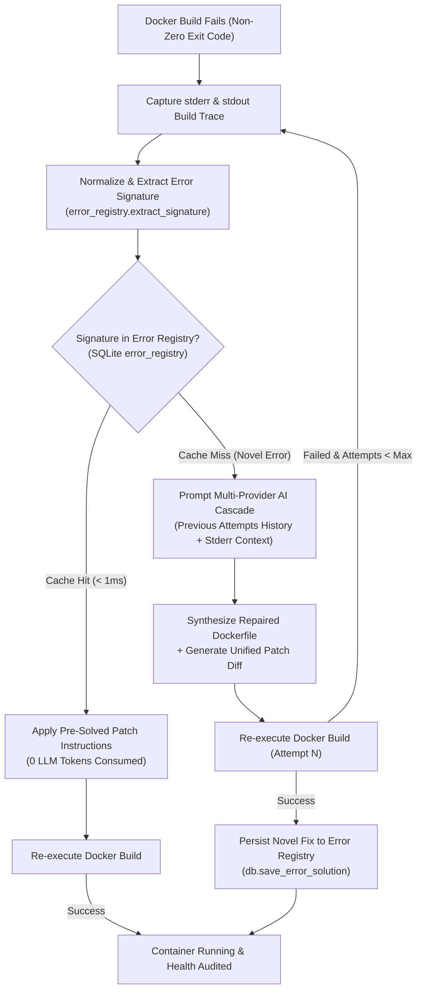

# 🛡️ Automated CVE Lab Builder & Multi-Tier Sandbox Replication Engine

## 1. Executive Summary & Objective

The **Automated CVE Lab Builder & Reproduction Engine** is an integrated threat intelligence, vulnerability verification, and isolated sandbox execution framework. Its primary objective is to eliminate manual configuration overhead for security teams, penetration testers, and DevSecOps engineers by automatically synthesizing end-to-end isolated environments alongside deterministic verification workflows for any targeted CVE.

The platform provides a complete, operational 4-pillar execution pipeline:
1. **Tier 1 (Priority): Local Container Sandbox** — Turnkey Vulhub recipes and AI-synthesized Dockerfile environments with closed-loop self-healing, active container lifecycle controls, and automated TCP/HTTP health auditing.
2. **Tier 2 (Backup): Remote Tri-OS SSH Sandboxes** — Dedicated remote physical or virtual execution targets (Linux, Windows, macOS) configured via `.env` with automated OS fingerprinting and non-interactive script staging.
3. **Tier 3 (Fallback): Legacy OS Archival Intelligence & ISO Finder** — Automatic matching of historical operating system builds, official archive mirrors (Ubuntu old-releases, Debian archive, CentOS vault, Windows Server eval), and hypervisor hardware profiles when containers cannot satisfy legacy kernel dependencies.
4. **Case-Based Error Resolution Registry (Error Memory)** — SQLite-persisted experience cache applying verified build patches in `< 1ms` at `0 token cost` before cascading to multi-turn AI models.

---

## 2. Multi-Tier System Architecture & Provisioning Hierarchy

```text
+-----------------------------------------------------------------------------------+
|                            User Query (CVE-YYYY-NNNNN)                            |
+-----------------------------------------------------------------------------------+
                                         |
                                         v
+-----------------------------------------------------------------------------------+
|                    Multi-Source Threat Intelligence Ingestion                     |
|  - NIST NVD 2.0 API (CVSS v2/v3 vectors, CPEs, vendor references)                 |
|  - CISA Known Exploited Vulnerabilities (KEV) Catalog (Zero-day flags)            |
|  - Exploit Intelligence: Vulhub, Exploit-DB, Rapid7 Metasploit, Nuclei YAML      |
|  - Stargazer-Ranked GitHub Proof-of-Concept Repositories                          |
+-----------------------------------------------------------------------------------+
                                         |
                                         v
+-----------------------------------------------------------------------------------+
|                   Multi-Provider AI Cascade Engine (300-500 t/s)                  |
|  - Groq (Llama 3.3 70B) -> Gemini 2.5 Flash -> Mistral -> Cerebras -> Ollama     |
|  - Threat Assessment & Mitigation Strategy Synthesis                              |
|  - Replication Blueprint & Deployment Modality Classifier                         |
+-----------------------------------------------------------------------------------+
                                         |
                                         v
+-----------------------------------------------------------------------------------+
|                   3-TIER REPLICATION SANDBOX PROVISIONING HIERARCHY               |
|                                                                                   |
|  [TIER 1 - PRIORITY] Local Container Sandbox (Docker / Vulhub)                   |
|    * Official Vulhub 1-Click Compose Launcher                                     |
|    * AI Blueprint Dockerfile Synthesizer                                          |
|    * Case-Based Error Resolution Registry (<1ms, 0 Tokens)                        |
|    * Closed-Loop LLM Self-Healing Loop (Iterative Error Memory Buffer)            |
|    * Collision-Free Ephemeral Port Allocator                                      |
|    * Automated TCP Socket & HTTP Banner Health Auditor (`lab_verifier.py`)        |
|                                                                                   |
|  [TIER 2 - BACKUP] Remote Tri-OS SSH Sandboxes (Linux / Windows / macOS)          |
|    * Dedicated Target Machines via `.env` (SANDBOX_LINUX, WIN, MAC)               |
|    * Non-Invasive SSH OS Fingerprinting (Kernel, Arch, Python, Latency)           |
|    * Base64 / SFTP Encoded Non-Interactive Script Stager                          |
|    * Real-Time Stdout / Stderr Stream Capture & Exit Status Evaluation            |
|                                                                                   |
|  [TIER 3 - FALLBACK] Legacy OS Archival Intelligence & ISO Finder                 |
|    * Deep CVE Metadata & Kernel Requirement Matcher                               |
|    * Official Historical Archive ISO Mirrors (Ubuntu, Debian, CentOS, Windows)    |
|    * EOL Package Mirror Splicer (sed commands resolving 404 retired mirrors)      |
|    * Hypervisor Hardware Profiles (RAM, vCPU, Host-Only Isolation)                |
+-----------------------------------------------------------------------------------+
                                         |
                                         v
+-----------------------------------------------------------------------------------+
|                    SQLite 3 Embedded Intelligence Layer (WAL Mode)                |
|  - `cves`, `github_pocs`, `exploit_intelligence`, `ai_analysis`, `lab_blueprints`  |
|  - `deployed_labs` (Active container telemetry, health audits, unified diffs)     |
|  - `error_registry` (Case-Based Reasoning signature memory, reuse metrics)        |
+-----------------------------------------------------------------------------------+
```

---

## 3. Provisioning Hierarchy Specifications

### 3.1 Tier 1: Local Container Sandbox (Docker & Vulhub)

Docker containerization is the primary deployment tier due to its rapid startup, low resource footprint, and repeatable filesystem isolation.

1. **Official Vulhub Turnkey Deployment**:
   - Queries the local Vulhub cache (`.vulhub_cache.json`) indexed from `vulhub/vulhub`.
   - Downloads the authoritative `docker-compose.yml` into a dedicated workspace: `labs/VULHUB_<CVE>/`.
   - Executes `docker compose up -d` with collision-free port mapping.
2. **AI Blueprint Build Engine**:
   - Generates a custom `Dockerfile` targeting the specific vulnerable version.
   - Manages container build cycles in `labs/<CVE>/`.
3. **Collision-Free Port Allocation**:
   - Dynamic port allocator (`find_free_host_port`) tests requested host ports and binds free alternative ports (`8080` ➔ `8081` ➔ `...`) to prevent bind collisions.
4. **Automated TCP & HTTP Verification Auditor (`lab_verifier.py`)**:
   - Performs TCP three-way handshake socket probes against target ports.
   - Issues non-destructive HTTP requests with standard browser headers.
   - Extracts server headers, title banners, and response status codes to verify that the service is operational.
5. **Container Lifecycle Controls**:
   - **Stop / Terminate**: Signals container termination with timeout.
   - **Restart**: Restarts target container with fresh state.
   - **Real-Time Log Streamer**: Buffers stdout/stderr container logs for real-time debugging.

---

### 3.2 Closed-Loop Self-Healing & Case-Based Error Memory

Container builds for legacy vulnerabilities frequently encounter build errors due to retired package mirrors (404 Not Found), interactive package prompts, or deprecated package managers. The platform implements a two-stage error correction architecture:



#### Deterministic Signatures Pre-Seeded in Memory:
| Signature ID | Error Pattern | Root Cause | Automated Resolution |
|---|---|---|---|
| `APT_DEBIAN_ARCHIVE_404` | `404 Not Found ... deb.debian.org` | Debian release is End-of-Life (EOL). | Replaces `deb.debian.org` with `archive.debian.org` and sets `Acquire::Check-Valid-Until "false";`. |
| `DEBIAN_FRONTEND_INTERACTIVE_HANG` | `debconf: unable to initialize frontend: Dialog` | apt-get hangs waiting for interactive prompt. | Prepends `ENV DEBIAN_FRONTEND=noninteractive`. |
| `PIP_PEP668_EXTERNALLY_MANAGED` | `error: externally-managed-environment` | Modern Python blocks global pip installs. | Appends `--break-system-packages` flag. |
| `YUM_CENTOS_VAULT_404` | `Cannot find a valid baseurl ... centos` | CentOS release mirrors retired to vault. | Rewires yum repository files to `vault.centos.org`. |
| `GPG_KEYSERVER_TIMEOUT` | `gpg: keyserver receive failed` | Port 11371 HKP timeout. | Enforces HTTP port 80 keyserver `hkp://keyserver.ubuntu.com:80`. |

---

### 3.3 Tier 2: Remote Tri-OS SSH Sandboxes (Linux, Windows, macOS)

When a vulnerability cannot run inside a Docker container (e.g. Linux kernel privilege escalations, Windows Active Directory / RPC flaws, or macOS system daemons), the engine fails over to **Tier 2 Remote SSH Sandboxes**.

#### Target Configuration Schema (`.env`):
```bash
# Target 1: Linux Remote Sandbox (Ubuntu, Debian, CentOS, RHEL)
SANDBOX_LINUX_HOST=192.168.1.101
SANDBOX_LINUX_PORT=22
SANDBOX_LINUX_USER=researcher
SANDBOX_LINUX_PASS=SuperSecurePass123!
# SANDBOX_LINUX_KEY=/home/user/.ssh/id_rsa
SANDBOX_LINUX_INFO=Ubuntu 22.04 LTS x86_64

# Target 2: Windows Remote Sandbox (Windows 10/11, Windows Server with OpenSSH)
SANDBOX_WIN_HOST=192.168.1.102
SANDBOX_WIN_PORT=22
SANDBOX_WIN_USER=Administrator
SANDBOX_WIN_PASS=WindowsAdminPass!
SANDBOX_WIN_INFO=Windows Server 2022 Datacenter

# Target 3: macOS Remote Sandbox (Darwin / Apple Silicon)
SANDBOX_MAC_HOST=192.168.1.103
SANDBOX_MAC_PORT=22
SANDBOX_MAC_USER=admin
SANDBOX_MAC_PASS=MacAdminPass!
SANDBOX_MAC_INFO=macOS 14 Sonoma (Apple Silicon)
```

#### Automated OS Fingerprinting:
Before executing scripts, the manager performs non-invasive remote diagnostic probing:
- **Linux**: Executes `uname -s -r -m`, parses `/etc/os-release`, and probes `python3 --version`.
- **Windows**: Executes `powershell.exe [System.Environment]::OSVersion.VersionString`, checks `$env:PROCESSOR_ARCHITECTURE`, and probes Python.
- **macOS**: Executes `sw_vers`, `uname -m`, and checks Apple Silicon vs. Intel architecture.

#### Non-Interactive Script Staging:
To prevent quote-escaping syntax errors and terminal hangs across heterogeneous shells:
- **Linux / macOS**: The script content is Base64-encoded locally, transferred, decoded on the remote host via `echo '<b64>' | base64 -d > /tmp/lab_setup_<cve>.sh`, granted `+x`, and executed via `bash`.
- **Windows**: The script is encoded into UTF-16LE Base64 and executed directly via `powershell.exe -NoProfile -NonInteractive -EncodedCommand <b64>`.

---

### 3.4 Tier 3: Legacy OS Archival Intelligence & ISO Finder

When target dependencies require vintage operating systems (e.g. Linux kernel 2.6.x/3.x, Windows Server 2008 R2, or glibc 2.12) that cannot run in modern containers or on the 3 SSH target machines, **Tier 3** provides archival intelligence:

1. **Intelligent Requirement Extraction**: Analyzes CVE description, affected CPEs, and kernel branch requirements (e.g. `Dirty COW` ➔ Linux kernel 3.13 / 4.4; `EternalBlue` ➔ Windows Server 2008 R2 SP1).
2. **Official Archive Mirror Matching**:
   - **Canonical Ubuntu Old-Releases**: Direct download links for Ubuntu 12.04 (Precise), 14.04 (Trusty), 16.04 (Xenial), 18.04 (Bionic).
   - **Debian Historical Archive**: Direct ISO netinst links for Debian 7 (Wheezy), 8 (Jessie), 9 (Stretch), 10 (Buster).
   - **CentOS Vault**: Direct links to CentOS 6.10 and 7.9 ISOs on `vault.centos.org`.
   - **Microsoft Evaluation Center & Heritage**: Windows Server 2008 R2 SP1, 2012 R2, 2016, 2019 evaluation ISO references.
3. **Archive Package Repository Configurations**: Provides ready-to-run `sed` commands for `/etc/apt/sources.list` or `/etc/yum.repos.d/` so package installations work seamlessly on retired OS releases.
4. **Hypervisor Hardware Profiles**: Defines recommended RAM (MB), vCPUs, Disk (GB), and isolated `Host-Only` network adapter settings for VirtualBox, VMware Workstation, and Proxmox/KVM.

---

## 4. SQLite Database Schema (`vulnerability_intel.db`)

All intelligence, active containers, blueprints, and error solutions are persisted in SQLite 3 with Write-Ahead Logging (`WAL` mode) enabled:

### 4.1 Table Specifications
| Table Name | Purpose | Primary Key | Key Indexes |
|---|---|---|---|
| `cves` | Authoritative NVD/KEV CVE metadata, CVSS vectors, severity | `cve_id` (TEXT) | `idx_cves_published`, `idx_cves_severity` |
| `github_pocs` | Stargazer-ranked PoC repositories | Auto-inc `id` | `idx_pocs_cve` (`cve_id`) |
| `exploit_intelligence` | Vulhub recipes, Exploit-DB, Metasploit, Nuclei | Auto-inc `id` | `idx_intel_cve` (`cve_id`) |
| `ai_analysis` | Executive threat analysis, CISO mitigation briefings | `cve_id` (TEXT) | — |
| `lab_blueprints` | Synthesized Dockerfiles, VM guides, execution steps | `cve_id` (TEXT) | — |
| `deployed_labs` | Active container state, host ports, health audits, diffs | `cve_id` (TEXT) | — |
| `error_registry` | Case-Based Reasoning error signatures, patches, reuse count | Auto-inc `id` | `idx_err_reg_sig` (`error_signature`) |
| `search_history` | Timestamped search queries powering history chips | Auto-inc `id` | `idx_history_cve` (`cve_id`) |

### 4.2 Error Registry Schema (`error_registry`)
```sql
CREATE TABLE IF NOT EXISTS error_registry (
    id INTEGER PRIMARY KEY AUTOINCREMENT,
    error_signature TEXT UNIQUE NOT NULL,
    error_category TEXT NOT NULL,
    sample_error_text TEXT,
    fix_description TEXT NOT NULL,
    patch_instructions TEXT NOT NULL,
    patch_type TEXT DEFAULT 'dockerfile_patch',
    model_source TEXT DEFAULT 'AI Cascade',
    times_reused INTEGER DEFAULT 1,
    verified_working INTEGER DEFAULT 1,
    created_at TIMESTAMP DEFAULT CURRENT_TIMESTAMP,
    last_used TIMESTAMP DEFAULT CURRENT_TIMESTAMP
);
CREATE INDEX IF NOT EXISTS idx_err_reg_sig ON error_registry(error_signature);
```

### 4.3 Deployed Labs Schema (`deployed_labs`)
```sql
CREATE TABLE IF NOT EXISTS deployed_labs (
    cve_id TEXT PRIMARY KEY,
    container_id TEXT,
    container_name TEXT,
    status TEXT,
    deployment_type TEXT,
    host_port INTEGER,
    container_port INTEGER,
    workspace_path TEXT,
    dockerfile_content TEXT,
    repair_history TEXT,
    health_status TEXT,
    audit_details TEXT,
    created_at TIMESTAMP DEFAULT CURRENT_TIMESTAMP,
    updated_at TIMESTAMP DEFAULT CURRENT_TIMESTAMP
);
```

---

## 5. Defensive Scope & Safety Boundaries

To ensure safe operational execution:
1. **RFC 1918 Private Addressing**: All generated container port bindings and scripts strictly bind to `127.0.0.1`, `localhost`, or private host-only subnets.
2. **Defensive Utility**: Instructions prioritize environment recreation, root-cause diagnosis, and patch verification rather than automated attack payload weaponization.
3. **Safe Offline Operation**: When Docker Desktop or remote SSH targets are unreachable, the UI displays informative status badges and diagnostic guidance rather than unhandled crashes.
